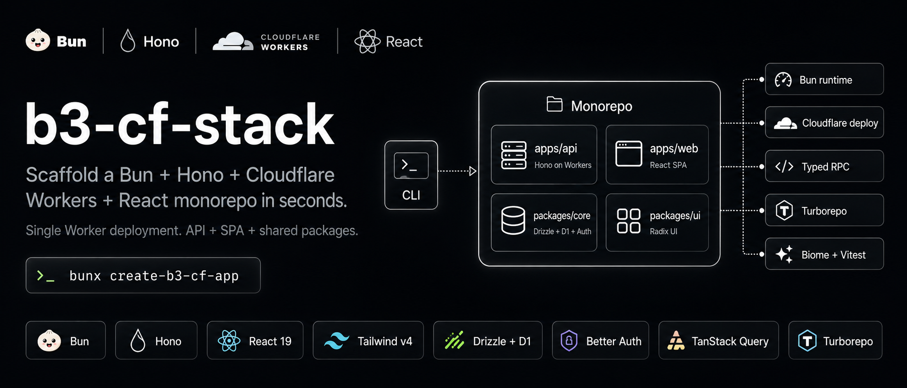

# create-b3-cf-app

Scaffold a **Bun + Hono + Cloudflare Workers + React** monorepo in seconds.



## Usage

```bash
bunx create-b3-cf-app
```

Follow the prompts — project name, description, install deps, init git.

## What you get

```
my-app/
├── apps/
│   ├── api/           # Hono API — runs on Cloudflare Workers
│   │   ├── src/       # Routes, middleware, lib
│   │   └── test/
│   └── web/           # React SPA — Vite + Tailwind v4
│       ├── src/       # Pages, components, hooks
│       ├── lib/rpc.ts # Typed Hono RPC client
│       └── index.html
├── packages/
│   ├── core/          # Shared DB (Drizzle + D1), auth, utils
│   └── ui/            # Radix UI component library
├── biome.json         # Lint + format
├── turbo.json         # Task runner
├── wrangler.jsonc     # Cloudflare Workers config
└── .github/           # CI + deploy workflows
```

## Stack

| Layer | Choice |
|---|---|
| Runtime | Bun |
| API | Hono |
| Frontend | React 19 + react-router-dom v7 |
| Styling | Tailwind CSS v4 |
| Database | Drizzle ORM + Cloudflare D1 |
| Auth | Better Auth |
| UI | Radix + class-variance-authority |
| Data fetching | TanStack React Query |
| Serialization | Superjson |
| Monorepo | Turborepo |
| Lint/format | Biome |
| Testing | Vitest |
| Deployment | Cloudflare Workers (single Worker, API + SPA) |

## Docs

Full documentation at **[create-b3-cf-app.vercel.app](https://create-b3-cf-app.vercel.app)** (coming soon) or in the [`docs/`](docs/) directory.

## Development

```bash
cd my-app
cd my-app
bun run dev
```

## Deployment

```bash
bun run cf:deploy
```

## Contributing

See [CONTRIBUTING.md](CONTRIBUTING.md).

## License

MIT — see [LICENSE](LICENSE).
